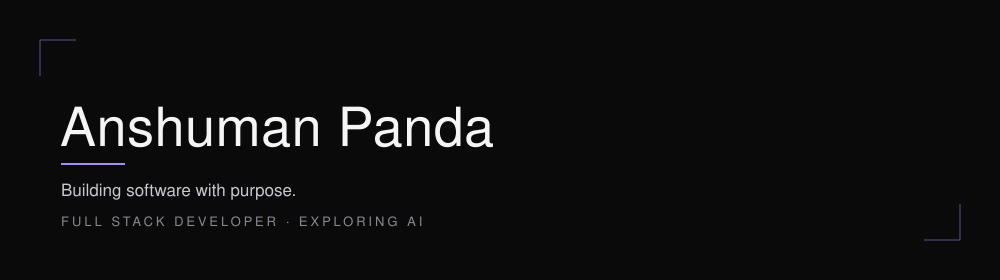
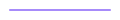
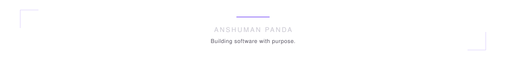

<!--
  README.md — Anshuman Panda
  GitHub username used throughout: Anshuman615
-->

 

  

<h2 align="center">About</h2>

Computer science student focused on full-stack engineering and applied AI. 
I work primarily with the MERN stack, and spend the rest of my time thinking 
about how interfaces should look and behave. 
Most of what I build starts as a design decision, not a technical one.

 

  

<h2 align="center">Current Focus</h2>

<table width="100%">
  <tr>
    <td width="30%"><strong>Working On</strong></td>
    <td width="70%">Full-stack applications built with React, Node.js, and MongoDB</td>
  </tr>
  <tr>
    <td width="30%"><strong>Learning</strong></td>
    <td width="70%">AI/ML fundamentals, applied to real product features</td>
  </tr>
  <tr>
    <td width="30%"><strong>Interested In</strong></td>
    <td width="70%">Developer tooling, applied AI, and interface design</td>
  </tr>
  <tr>
    <td width="30%"><strong>Open To Collaboration</strong></td>
    <td width="70%">Internships and small, well-scoped engineering projects</td>
  </tr>
</table>

 

  

<h2 align="center">Skills</h2>

LANGUAGES

  

FRONTEND

  

BACKEND

  

TOOLS

 

  

<h2 align="center">Projects</h2>

 

<h4>AI Chat Application</h4>

A conversational assistant with support for multi-turn context and image input.

<a href="#">View code</a> &nbsp;·&nbsp; <a href="#">Live</a>

<h4>Document Workspace</h4>

A browser-based rich text editor built for fast, distraction-free writing.

<a href="#">View code</a> &nbsp;·&nbsp; <a href="#">Live</a>

<h4>Language Learning Platform</h4>

A web app for practicing new languages through short, structured daily lessons.

<a href="#">View code</a> &nbsp;·&nbsp; <a href="#">Live</a>

 

  

<h2 align="center">GitHub Analytics</h2>

 

  

  

 

  

<h2 align="center">Contribution Graph</h2>

 

<picture>
  <source media="(prefers-color-scheme: dark)" srcset="https://raw.githubusercontent.com/Anshuman615/Anshuman615/output/snake-dark.svg" />
  <source media="(prefers-color-scheme: light)" srcset="https://raw.githubusercontent.com/Anshuman615/Anshuman615/output/snake-light.svg" />
  
</picture>

 

  

<h2 align="center">Connect</h2>

<a href="mailto:anshumanpanda744@gmail.com">Email</a>
&nbsp;&#183;&nbsp;
<a href="https://www.linkedin.com/in/anshumanpanda156/">LinkedIn</a>
&nbsp;&#183;&nbsp;
<a href="https://github.com/Anshuman615">GitHub</a>

 

